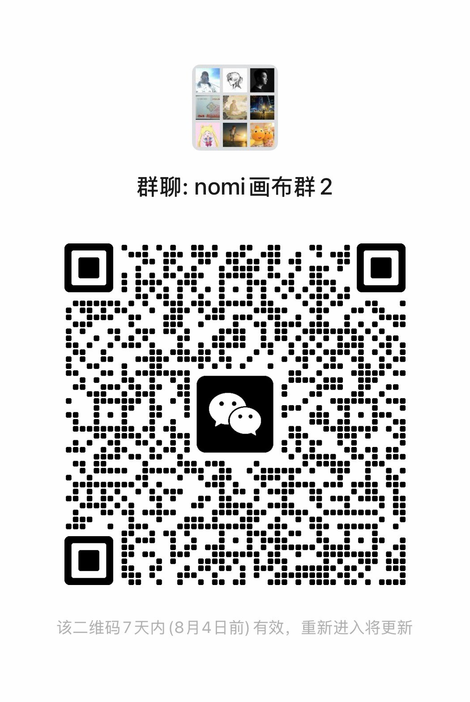
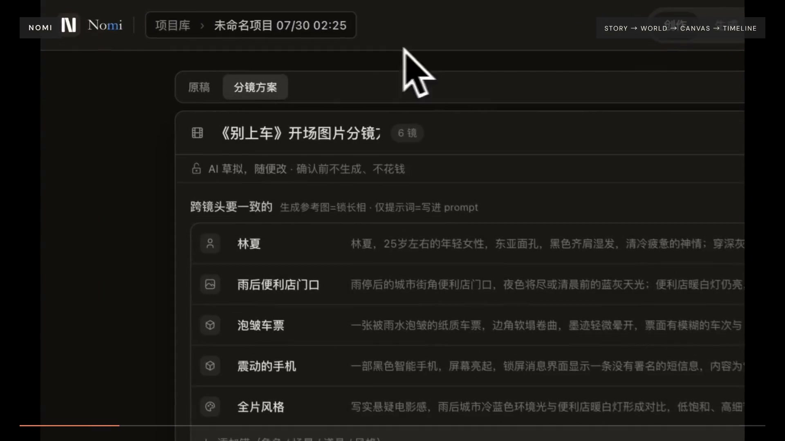

<p align="center">
  
</p>

# Nomi

**Direct the shot. Not just the prompt.**

Nomi is an open-source, local-first AI video workbench that keeps your story, storyboard, visual anchors, generation canvas, and timeline connected.

[简体中文](README.zh-CN.md) · [Website](https://nomiaqm.com/en/) · [Download](https://github.com/aqm857886159/Nomi/releases/latest) · [Community](https://github.com/aqm857886159/Nomi/discussions) · [For Teams](https://nomiaqm.com/en/#teams) · [Watch the 60s film](https://nomiaqm.com/assets/video/launch-film-en.mp4) · [Documentation](docs/user-guide.md)

## WeChat / 微信联系

### Join the Nomi user group / 加入 Nomi 用户群

<p align="center">
  <a href="docs/media/nomi-canvas-group-wechat.png"></a>
</p>

<p align="center">
  <strong>Scan to join the user group. / 扫码加入 Nomi 用户群</strong><br />
  Product feedback from the group goes directly into ongoing iteration. / 群内反馈会直接进入产品迭代。
</p>

### Maintainer & project collaboration / 添加作者与项目合作

<p align="center">
  <a href="docs/media/qingyang-wechat.jpg"></a>
</p>

<p align="center">
  If the group QR expires, or for custom builds, integrations, white-label delivery, and ongoing iteration, add <strong>TZ857886159</strong>.<br />
  群码失效，或沟通定制开发、系统集成、贴牌交付与持续迭代，请添加作者微信 <strong>TZ857886159</strong>。
</p>

International community: [GitHub Discussions](https://github.com/aqm857886159/Nomi/discussions) · Project inquiry: [Business Inquiry](https://github.com/aqm857886159/Nomi/issues/new?template=business_inquiry.yml)

[](https://github.com/aqm857886159/Nomi/releases/latest)

[](LICENSE)

[](https://nomiaqm.com/assets/video/launch-film-en.mp4)

## Why Nomi

- **Connected context** — Story, characters, storyboard, generated evidence, and timeline stay in one project instead of being copied between disconnected tools.
- **Visual anchors** — Lock characters, locations, props, camera, and style before generation so later shots inherit the same world.
- **Directable workflow** — Arrange the sequence on canvas, connect references, choose generation results, and finish on a real timeline.
- **Agentic creation over MCP** — Connect Claude Code, Codex, or Cursor with one click. The assistant can call Nomi over MCP, use Skills to create a project, storyboard shots, connect references, and advance an editable first cut. You keep final control over the images, edits, and export.

## Download

| System | Build | Download |
|---|---|---|
| macOS | Apple Silicon | [Nomi-mac-arm64.dmg](https://github.com/aqm857886159/Nomi/releases/latest/download/Nomi-mac-arm64.dmg) |
| macOS | Intel | [Nomi-mac-intel.dmg](https://github.com/aqm857886159/Nomi/releases/latest/download/Nomi-mac-intel.dmg) |
| Windows | Windows 10 / 11 | [Nomi-windows-setup.exe](https://github.com/aqm857886159/Nomi/releases/latest/download/Nomi-windows-setup.exe) |

<details>
<summary>First launch warning on macOS or Windows</summary>

- **macOS:** Move `Nomi.app` to Applications, run `xattr -cr /Applications/Nomi.app` in Terminal, then open it again.
- **Windows:** In the SmartScreen prompt, choose **More info** → **Run anyway**.

</details>

## Quick start

1. **Connect a model.** Choose a curated provider and enter one API key, or add your own OpenAI-, Responses-, or Anthropic-compatible endpoint.
2. **Write the intent.** Start with a story or one shot. Ask Nomi—or a connected AI assistant over MCP—to build an editable storyboard and canvas plan.
3. **Direct and export.** Review visual anchors, generate images or video with your configured models, choose the results, arrange the timeline, and export MP4.

Read the [user guide](docs/user-guide.md), [provider guide](docs/provider-integration.md), or [CLI + MCP guide](docs/guide/capability-core-cli-mcp.md).

## Community

Join [GitHub Discussions](https://github.com/aqm857886159/Nomi/discussions) to share workflows, report friction, and follow what is being built next. WeChat users can use the group and maintainer QR codes at the top of this README; the [Chinese README](README.zh-CN.md#用户群) contains the full Chinese guide.

## For Teams

Nomi is open source for creators. We also provide **Custom builds**, **Integrations**, **White-label / commercial licenses**, and **Ongoing iteration** for teams that need Nomi adapted to a real delivery workflow.

[Discuss a project](https://github.com/aqm857886159/Nomi/issues/new?template=business_inquiry.yml). The form is public: share only a non-confidential summary and never post credentials, private contact details, budget details, or NDA-protected information.

## Developers

Requires Node.js 20+ and pnpm.

```bash
git clone https://github.com/aqm857886159/Nomi.git
cd Nomi
corepack enable
pnpm install
pnpm dev
```

```text
electron/    Electron main process, local runtime, storage, and model calls
src/         React + Vite + Tailwind workbench
skills/      Skill Pack v2; see docs/skill-pack-format.md
```

Useful checks:

```bash
pnpm run test
pnpm run typecheck
pnpm run gates
```

## Contributing

Bug reports, feature proposals, documentation, and code contributions are welcome. External contributors sign the one-time [Contributor License Agreement](CLA.md) when a pull request is opened.

- [Report a bug](https://github.com/aqm857886159/Nomi/issues/new?template=bug_report.yml)
- [Request a feature](https://github.com/aqm857886159/Nomi/issues/new?template=feedback.yml)
- [Join a discussion](https://github.com/aqm857886159/Nomi/discussions)

## License

Current releases are licensed under AGPL-3.0-only; historical releases published under Apache-2.0 keep their original license.

See [LICENSE](LICENSE). Contact the maintainer through the [Business inquiry](https://github.com/aqm857886159/Nomi/issues/new?template=business_inquiry.yml) for a commercial license covering closed-source integration or white-label distribution.
